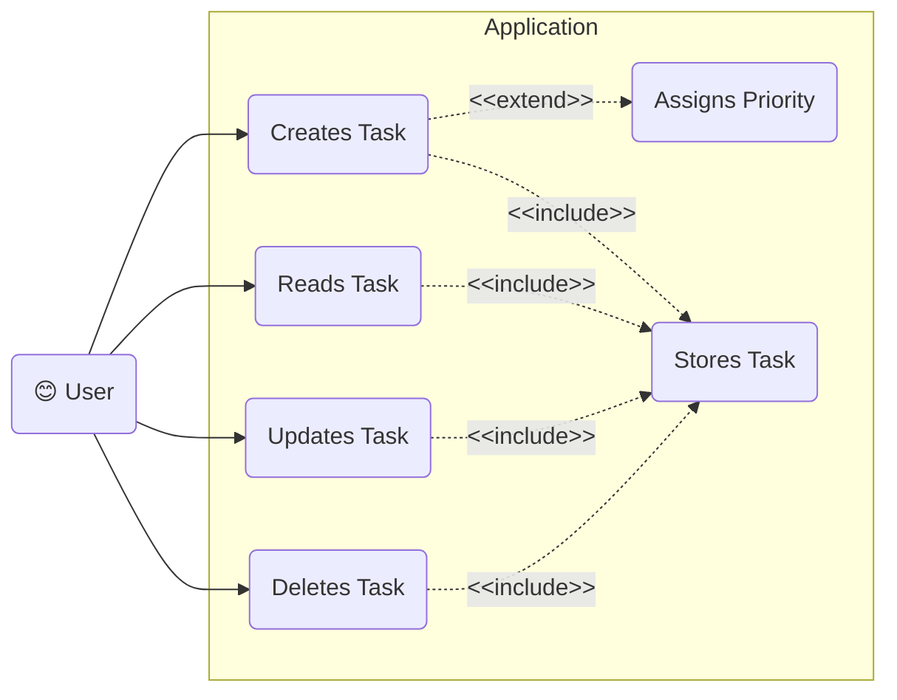
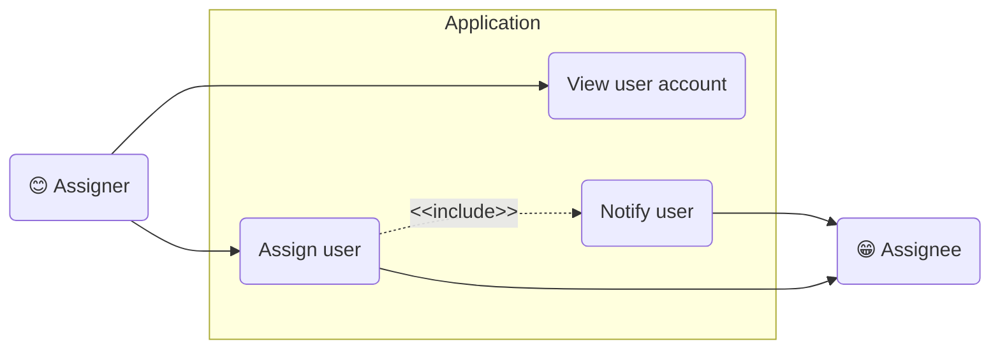

# Priority Queue

This is a task management app that uses a priority queue to help you manage your tasks. This allows users to focus on resolving the important stuff, one thing at a time.

## Requirements

To satisfy the requirements of the GSIC Systems Analyst - 224176 - Interview Assignement, this project will have to implement:

    - [X] Use case diagram
    - [X] CRUD operations on individual tasks
    - [ ] Dashboard displaying all tasks
    - [ ] Task search functionality
    - [ ] Notifications upon being assigned a task
    - [X] Persistent storage of tasks through a database system
    - [X] Authentication
        - User: Able to perform CRUD operations an tasks they created or that have been assigned to them.
        - Admin: Able to perform CRUD operations on tasks created by any user.

### Implementation Requirements

    - [X] Flask, Django or Express backend
    - [ ] React, Angular, Vue.js frontend
    - [X] PostgreSQL, MySQL or NoSQL database

## Use Cases

Use case #1: User can perform CRUD operations on tasks stored in the application with the option to manually assign priority, or have the priority assigned automatically.

```mermaid
flowchart LR;
    A(😊 User);
    A-->1;
    A-->2;
    A-->3;
    A-->4;
    
    subgraph "Application";

    6(Assigns Priority);
    1(Creates Task);
    2(Reads Task);
    3(Updates Task);
    4(Deletes Task);
    5(Stores Task);
    
    1-.&lt;&lt;extend&gt;&gt;.->6
    end;
    
    1-. &lt;&lt;include&gt;&gt; .->5
    2-. &lt;&lt;include&gt;&gt; .->5;
    3-. &lt;&lt;include&gt;&gt; .->5;
    4-. &lt;&lt;include&gt;&gt; .->5;
```

Use case #2: Any user can assign a task to other User which triggers a notification to be sent to the Assignee.

```mermaid
graph LR;
    A(😊 Assigner);
    A--->3;
    subgraph Application;
    direction TB;
        
    3(View user account);
    1(Assign user);
    2(Notify user);
    
    1-. &lt;&lt;include&gt;&gt; .->2;
    end;
    B(😁 Assignee);
    A-->1;
    1-->B;
    2-->B;
```

## Accounts

To prevent a exposing all the users of the platform to random assignment of tasks, any user who wants to assign a task will need to know a unique identifier for each user. I can use `https://github.com/alexanderlukanin13/coolname` for this.
