# Priority Queue

This is a task management app that uses a priority queue to help you manage your tasks. This allows users to focus on resolving the important stuff, one thing at a time.

## Requirements

To satisfy the requirements of the GSIC Systems Analyst - 224176 - Interview Assignement, this project will have to implement:

- [X] Use case diagram
- [X] CRUD operations on individual tasks
- [X] Dashboard displaying all tasks
- [X] Task search functionality
- [X] Notifications upon being assigned a task
- [X] Persistent storage of tasks through a database system
- [X] Authentication
    - User: Able to perform CRUD operations an tasks they created or that have been assigned to them.
    - Admin: Able to perform CRUD operations on tasks created by any user.
- [X] Documentation

### Implementation Requirements

- [X] Flask, Django or Express backend
- [X] React, Angular, Vue.js frontend
- [X] PostgreSQL, MySQL or NoSQL database

## Use Cases

Use case #1: User can perform CRUD operations on tasks stored in the application with the option to manually assign priority, or have the priority assigned automatically.

```mermaid
flowchart LR;
    A(😊 User);
    A-->1;
    A-->2;
    A-->3;
    A-->4;
    
    subgraph "Application";

    6(Assigns Priority);
    1(Creates Task);
    2(Reads Task);
    3(Updates Task);
    4(Deletes Task);
    5(Stores Task);
    
    1-.&lt;&lt;extend&gt;&gt;.->6
    end;
    
    1-. &lt;&lt;include&gt;&gt; .->5
    2-. &lt;&lt;include&gt;&gt; .->5;
    3-. &lt;&lt;include&gt;&gt; .->5;
    4-. &lt;&lt;include&gt;&gt; .->5;
```

Use case #2: Any user can assign a task to other User which triggers a notification to be sent to the Assignee.

```mermaid
graph LR;
    A(😊 Assigner);
    A--->3;
    subgraph Application;
    direction TB;
        
    3(View user account);
    1(Assign user);
    2(Notify user);
    
    1-. &lt;&lt;include&gt;&gt; .->2;
    end;
    B(😁 Assignee);
    A-->1;
    1-->B;
    2-->B;
```

## Installation
For the sake of simplicity I have preconfigured django with the credentials to use a cloud hosted PostgreSQL database. This will allow you to deploy the app without having to run a local instance of PostgreSQL, if you encounter any issues relating to database connection while deploying the app please reachout at [developer@alexmgullen.ca](mailto:developer@alexmgullen.ca) so I can troubleshoot the connection. I also hardcoded the database credentials to simplify code shareing. I'm well aware this isn't the way code should be shared.

1. Have Git, Python and Node installed on your computer
2. Open two instances of windows CMD.
3. In one of the repos clone this repo using `git clone https://github.com/AlexanderGullen/priority_queue` command.
4. Move both instances of the windows CMD into the 'priority_queue' folder using the `cd priority_queue`.

> NOTE: The first CMD, henceforth reffered to as the 'python terminal', will be used to run the backend, the second will be used to run Node and will be referred to as the 'node terminal'

5. (Optional) In the 'python terminal', create a python virtual environment with the command `python -m venv .\venv`.
6. (Optional) In the 'python terminal', start the virtual environment using the command `.\venv\Scripts\Activate`.
7. In the 'python terminal', install the python required packages by running `pip install -r requirements.txt`.
8. In the 'python terminal', run the backend using the command `python backend\manage.py runserver`. This will start the Django backend.

9. In the 'node terminal', move into the frontend folder using `cd frontend` command.
10. In the 'node terminal', install the node requirements by running `npm install requirements`.
11. In the 'node terminal', run the frontend using the command `npm run dev`.

Now you will have both the backend and frontend runing on your computer, you should be able to open [http://localhost:5173/](http://localhost:5173/) in a web browser and see the app. Any support questions can be directed to [developer@alexmgullen.ca](mailto:developer@alexmgullen.ca).
